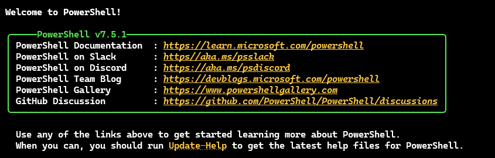
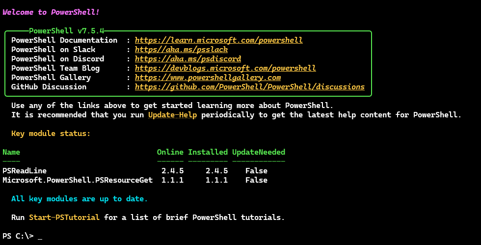
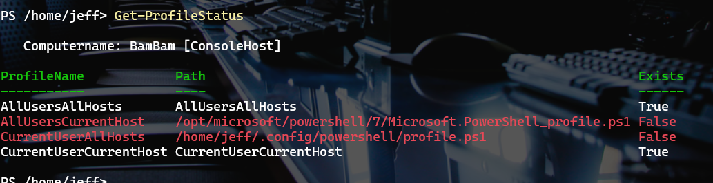
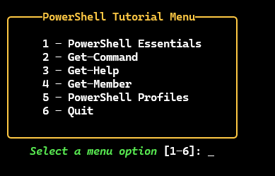
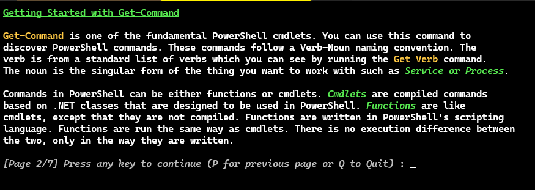
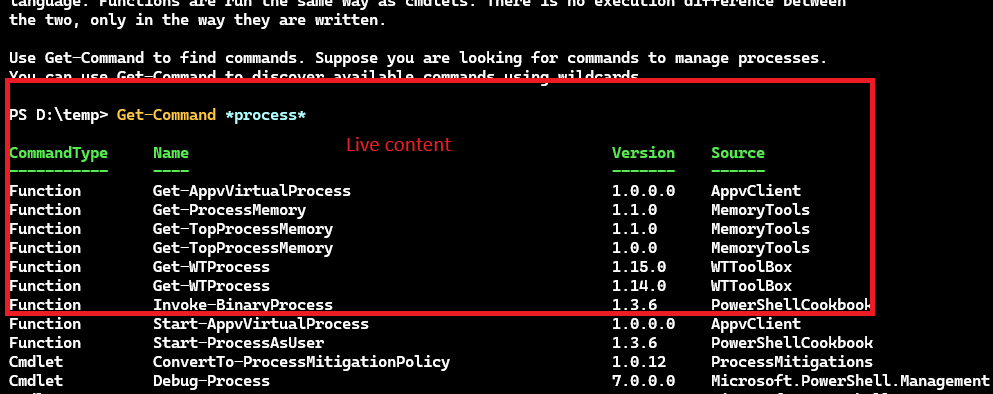

# PSIntro

[](https://www.powershellgallery.com/packages/PSIntro/) [](https://www.powershellgallery.com/packages/PSIntro/)


This is an __educational and reference__ module targeted for PowerShell beginners, although everyone is welcome to install and use the module.

## Installation

This module has been revised to support Windows PowerShell and PowerShell 7. It should work on Windows, Linux, and macOS. To install the module from the PowerShell Gallery, run the following command:

```powershell
Install-Module PSIntro
```

If you are using the newer, and recommended `Microsoft.PowerShell.PSResourceGet` module, run:

```powershell
Install-PSResource -Name PSIntro
```

> *Due to the major revisions to support Windows PowerShell and significant changes to the tutorial framework, the module version was increased to 2.0.0. All previous versions of this module will only run on PowerShell 7.*

## Overview

This module grew out of discussions with Jason Helmick about providing a beginner interface to PowerShell for new users. Years ago, some products would offer a "splash" or welcome screen when the application started. This module provides similar functionality for PowerShell. In addition to a splash screen of information, the module also includes a set of interactive tutorials for beginners on core PowerShell concepts.

The module also includes a few commands designed to help absolute beginners get started managing their PowerShell environment.

## [Get-PSIntro](docs/Get-PSIntro.md)

When the user starts PowerShell, they can be presented with this welcome or "splash" screen.



When run in Windows Terminal, or similar, the links should be clickable, including a link to online help for `Update-Help`. This is a command that could go into a user's profile.

```powershell
Get-PSIntro
```

> *This command has aliases of `psintro` and `pswelcome`.*

If the user runs:

```powershell
Get-PSIntro -tutorial
```

This will display the welcome screen with a tutorial prompt.


The user can also use the `-ModuleStatus` parameter to display the status of key modules.

```powershell
Get-PSIntro -ModuleStatus
```



If you would like to only see the splash screen of links, use the `WelcomeOnly` parameter which has an alias of `SplashOnly`. This is useful if you want to add the command to your profile but do not want to display the tutorial prompt or module status.

```powershell
Get-PSIntro -WelcomeOnly
```

> This parameter was added in version 2.1.0.
>

## [Get-ModuleStatus](docs/Get-ModuleStatus.md)

This information is also available by running the `Get-ModuleStatus` command.

```powershell
PS C:\> Get-ModuleStatus

Name                               Online Installed UpdateNeeded
----                               ------ --------- ------------
PSReadLine                         2.4.5  2.4.5     False
Microsoft.PowerShell.PSResourceGet 1.1.1  1.1.1     False
```

If the module requires an update, it will be styled in red. This feature is meant to provide a quick reference of critical modules. The default modules were selected as they have a high impact on the user experience.

However, you can pass any list of module names to check their status.

```powershell
PS C:\> Get-Content C:\work\modlist.txt | Get-ModuleStatus

Name                                 Online Installed UpdateNeeded
----                                 ------ --------- ------------
PSReadLine                           2.4.5  2.4.5     False
Microsoft.PowerShell.PSResourceGet   1.1.1  1.1.1     False
Microsoft.PowerShell.ThreadJob       2.2.0  2.1.0     True
Microsoft.PowerShell.ConsoleGuiTools 0.7.7  0.7.7     False
Pester                               5.7.1  5.7.1     False
```

## [Get-ProfileStatus](docs/Get-ProfileStatus.md)

The module also includes a command to display the status of PowerShell profile scripts. It will not create them but it will report the location of each profile script and whether it exists.



## [New-PSProfile](docs/New-PSProfile.md)

Because this module is designed for an absolute beginner, it includes a command to create PowerShell profile scripts. The default behavior is to create the profile script for the current user in the current PowerShell host.

```powershell
PS C:\> New-PSProfile

    Directory: C:\Users\jeff\Documents\PowerShell

Mode                 LastWriteTime         Length Name
----                 -------------         ------ ----
-a--             1/8/2026  8:13 AM              0 Microsoft.PowerShell_profile.ps1
```

You can specify a different profile script by using the `-Name` parameter.

```powershell
PS C:\> New-PSProfile -Name AllUsersCurrentHost -WhatIf
What if: Performing the operation "Create File" on target "Destination: C:\Program Files\PowerShell\7\Microsoft.PowerShell_profile.ps1".
```

The command has tab-completion support for the `-Name` parameter to see the available profile script names.

To learn more about profile scripts, run the "PowerShell Profiles" tutorial and read the help documentation:

```powershell
PS C:\>help about_Profiles
```

## [Start-Tutorial](docs/Start-Tutorial.md)

The module includes a set of interactive tutorials. Running `Start-Tutorial` presents a simple menu.



Or the user can run the command specifying a topic.

```powershell
PS C:\> Start-Tutorial 'Get-Command'
```

If the user elects to run tutorials from the welcome screen, the tutorials will be run consecutively in a pre-defined order. No menu will be presented.



## [Add-PSIntro](docs/Add-PSIntro.md)

You can use this command to add a Start-PSIntro command to your PowerShell profile. This will cause the Start-PSIntro command to run automatically each time you start a new PowerShell session. You can customize the command by using the ModuleStatus and Tutorial parameters which will add the corresponding parameters to the Start-PSIntro command in your profile.

```powershell
PS C:\> Add-PSIntro -ModuleStatus
```

This will add the command `Start-PSIntro -ModuleStatus` to the end of your PowerShell profile script for the current user in the current PowerShell host.

## Tutorials

The module contains a set of tutorials written for absolute PowerShell beginners. The tutorials are written as PowerShell scripts with a combination of formatted text and __live__ console output from the user's session. This ensures that output is relevant to the user's environment.



The tutorials use ANSI for formatting. These settings are not user-configurable at this time.

You can quit a tutorial at any time by entering `q` at the prompt. Version 2.0.0 of this module introduced a simple navigation feature that allows you to return to the previous "page" of the tutorial by entering `p`. Note that your progress __will not be saved__. However, the tutorials are short enough that you can quickly page through them again.

## Localization

Beginning with v0.8.0 message strings are localized for `en-US` and `fr-FR` cultures. Support for `de-DE` was added in v0.10.0. Tutorials have been translated from English using Claude Sonnet 3.7. All other localization translations were done in VS Code using GPT-5 mini.

> __*I welcome pull requests with human-reviewed translations.*__

If you add a new localization, you should include a culture-specific folder that is properly cased. Inside the folder should be a localized version of `PSIntro.psd1`. There should also be a `tutorials` folder with localized tutorial scripts. Finally, there should be a folder for localized Markdown help files. __Do not localize any of the Markdown headings such as `## Synopsis`__.

This file should be named with the last part of the culture name. For example, if you are providing a Spanish localization using the `es-ES` culture, the docs folder name would be `docs-ES`. All other files would be placed in `es-ES`. I will generate help files from the localized Markdown files with each new release.

__Pay close attention to the casing of the culture name when creating a localized folder.__

```powershell
PS C:\> Get-Culture -Name es-es

LCID             Name             DisplayName
----             ----             -----------
3082             es-ES            Spanish (Spain)
```

## Future Development

This is a list of items under consideration for future development of this module.

- Are there other key modules that should be included by default?
  - Microsoft.PowerShell.ThreadJobs
  - Microsoft.PowerShell.ConsoleGuiTools
  - Pester
- Export tutorials to Polyglot notebooks
- Possible additional tutorial topics:
  - PSReadline fundamentals
  - Using $PSStyle
  - PSResourceGet
- Create a tutorial authoring framework

Please use the [Discussions](https://github.com/jdhitsolutions/PSIntro/discussions) section of the project's GitHub repository to share your thoughts, ideas, and suggestions.
